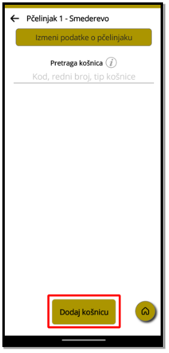

Pčelarski Dnevnik – Uputstvo za upotrebu

# Sadržaj
[1.	Uvod	3](#_toc180350283)

[2.	Instaliranje i pokretanje aplikacije	3](#_toc180350284)

[2.1.	Prihvatite da ćete postati tester aplikacije i instalirajte	3](#_toc180350285)

[3.	Pokretanje aplikacije	7](#_toc180350286)

[4.	Korišćenje aplikacije	8](#_toc180350287)

[4.1 Podešavanja	8](#_toc180350288)

[4.2. Dodavanje pčelinjaka i košnica	9](#_toc180350289)

[4.3 Detalji košnice – Matice, napomene, prinosi	12](#_toc180350290)

[4.4 Grupe košnica – Dodavanje, izmena, uklanjanje	20](#_toc180350291)

[4.4.1 Seljene košnice	21](#_toc180350292)

[4.4.2 Košnice za zamenu matice	26](#_toc180350293)

[4.4.3 Košnice dobre u paši	29](#_toc180350294)

[4.4.4 Košnice za reproodukciju	31](#_toc180350295)

[4.4.5 Košnice za kontrolu	33](#_toc180350296)

[4.4.6 Košnice za dohranu	35](#_toc180350297)

[4.4.7. Grupe - Zaključak	36](#_toc180350298)

[4.5. Podsetnici	37](#_toc180350299)

[4.6. Pretraga svih košnica	38](#_toc180350300)

[5.	Zaključak	40](#_toc180350301)

1. # Uvod
Verujemo da su Vam Vaše pčele bitne u istoj meri kao što ste i Vi njima, zato smo u procesu izrade aplikacije koja će Vam pomoći da u svakom trenutku imate uvid u kakvoj su formi Vaši sakupljači tečnog zlata.

Aplikacija *Pčelarski Dnevnik* pruža mogućnost evidentiranja podataka o Vašim pčelinjacima, košnicama, transportima na pašu kao i drugih korisnih informacija. Namenjena je pčelarima, bilo da ste profesionalac ili početnik, ova aplikacija će vam pomoći da imate uvid u stanje svojih košnica bilo gde da se nalazite.
1. # Instaliranje i pokretanje aplikacije
Aplikacija je trenutno dostupna samo za Android pametne uređaje.

Da biste preuzeli apliakciju *Pčelarski Dnevnik*, otvorite link u nastavku koji će Vas odvesti na Google Play store: <https://play.google.com/apps/testing/rs.hexatech.beekeeperdiary> 

Ili skenirajte QR kôd Vašim Android telefonom

Slika 1 - *Pčelarski dnevnik QR kôd*
1. ## Prihvatite da ćete postati tester aplikacije i instalirajte
Aplikacija je trenutno u fazi testiranja, Vi imate mogućnosta da je isprobate pre svih. Nakon otvaranja pomenutog linka ili skenirana QR kôd prikazaće Vam se sledeći ekran

Slika 2 - *Postani tester*

Potrebno je kliknuti na dugme **„BECOME A TESTER“**, nakon čega će se prikazati sledeća stranica

Slika 3 - *Preusmeravanje na Google Play*

Ovde je potrebno kliknuti na **„download it on Google Play“** da bi se prikazala finalna stranica na kojoj i aplikacija i dugme za instaliranje

Klikom na dugme **„Instaliraj“** će se preuzeti aplikacija i biće dostupna u Vašem meniju među ostalim aplikacijama. Prikazaće Vam se jedan od dva ekrana:

                  

Slika 4 - *Dugme za instaliranje*

1. # Pokretanje aplikacije
Nakon instaliranja, klikom na dugme „Otvori“ aplikacija bi trebalo da se pokrene automatski, ali ukoliko se to ne desi potrebno je pronaći je u meniju i pokrenuti. Naziv aplikacije je **„Pčelarski dnevnik“** a ikonica je

` `

Slika 5 - *Ikonica aplikacije*

Potrebno je dozvoliti aplikaciji da koristi kameru kako bi skenirala barkôdove koji se nalaze na košnicama. To radimo tako što dodirnemo dugme „**Dok koristim aplikaciju**“.

Takođe, aplikacija dodaje podsetnike u kalendar pa je potrebno dozvoliti i pristup kalendaru. To radimo tako što dodirnemo dugme „**Dozvoli**“

                      

`                   `Slika 6 – *Dozvoli korišćenje kamere*                    Slika 7 – *Dozvoli pristup kalendaru*
1. # Korišćenje aplikacije
U nastavku ovog korisničkog uputstva biće objašnjene osnovne funkcije aplikacije.
## 4.1 Podešavanja
Na početnoj strani u gornjem desnom uglu postoji dugme na čiji dodir se otvara stranica sa podešavanjima. Ovde možemo pročitati informacije o aplikaciji, postaviti boju aplikacije (automatska, tamna ili svetla), napraviti ili učitati rezervnu kopiju podataka aplikacije i obrisati sve podatke iz aplikacije.

                 

`  `Slika 8 – *Početna, otvaranje podešavanja*                            Slika 9 – *Stranica sa podešavanjima*

- Dodirom dugmeta „**O aplikaciji i kontakt**“ prikazuju se osnovne informacije o aplikaciji i kontakt e-mail i telefon preko kog nam se možete obratiti ukoliko imate bilo kakvih pitanja ili predloga.
- Boja aplikacije je podrazumevano automatska, što znači da će biti tamna ili svetla u zavisnosti od podešavanja na Vašem uređaju. Dodirom na prekidač moguće je uključiti tamnu ili svetlu pozadinu aplikacije.
- Dodirom dugmeta „**Kreiraj kopiju**“ otvara se nova stranica u kojoj korisnik bira lokaciju u memoriji na kojoj će biti sačuvana datoteka koja predstavlja rezervnu kopiju koja kasnije može biti uvezena u aplikaciju na istom ili drugom mobilnom uređaju.
- Dodirom dugmeta „**Uvezi kopiju**“ korisnik može izabrati prethodno kreiranu datoteku.
- Dodirom na dugme „**Obriši sve**“, uklanjaju se svi podaci iz aplikacije – aplikacija je kao prvog dana nakon instalacije.

## ` `4.2. Dodavanje pčelinjaka i košnica
Prvi korak u korišćenju aplikacije je dodavanje pčelinjaka. Na početnoj strani na dnu ekrana imamo dugme „**Dodaj pčelinjak**“. Dodirom na pomenuto dugme se otvara stranica na kojoj korisnik može uneti naziv pčelinjaka, lokaciju i ID broj pčelinjaka koji kasnije može koristiti za prijavu stanja na pčelinjaku.

          

`     `Slika 10 – *Početna, dodavanje pčelinjaka*                         Slika 11 – *Unos podataka o pčelinjaku*

Nakon unosa podataka o pčelinjaku, na početnoj će se pojaviti stavke koje predstavljaju unete pčelinjake. Na njima možemo videti osnovne informacije kao što su naziv, lokacija i ukupan broj košnica na pčelinjaku. Dodirom na neku od ovih stavki se prikazuju košnice na tom pčelinjaku, na ovoj strani možemo promeniti podatke o izabranom pčelinjaku. 

Takođe, imamo mogućnost pretrage košnica u pčelinjaku, a na dnu ekrana postoji dugme „**Dodaj košnicu**“ za dodavanje košnica u izabrani pčelinjak.

       

`           `Slika 12 – *Pčelinjak, dodaj košnicu*                               Slika 13 – *Unos posataka o košnici*

Na ovoj strani se automatsku pokreće kamera i u gornjem delu vidimo šta se trenutno skenira. Korisnik može uperiti telefon i skenirati barkôd na košnici kako bi ubrzao unos podataka, takođe, moguć je ručni unos identifikacionog broja košnice u polju ispod. Na ovoj stranici je obavezno izabrati tip košnice nakon čega se podaci mogu sačuvati.

Ako se vratimo na prethodnu stranu videćemo listu košnica koje smo prethodno dodali. U polje za pretragu možemo uneti tekst po kom tražimo košnice, na primer unesemo „voja“. U ovom slučaju prikazuju se košnice koje imaju tipove „Eko Voja“ i „Rodna Voja“:

    

`           `Slika 14 – *Sve košnice u pčelinjaku*                                Slika 15 – *pretraga košnica - „voja“*

## 4.3 Detalji košnice – Matice, napomene, prinosi
Kada iz liste košnica izaberemo onu čije detalje želimo prikazati ili izmeniti, otvara nam se sledeća stranica.

Slika 16 – *Detalji košnice*

Na ovoj strani vidimo osnovne podatke košnice, podatke o trenutnoj matici, poslednju napomenu koja je dodata za izabranu košnicu i ukupne prinose.

Dodirom na prvu karticu, u kojoj se nalazi naziv pčelinjaka i tip košnice otvara se stranica na kojoj možemo izmeniti ove informacije.

       

`           `Slika 17 – *Košnica, osnovni podaci*                               Slika 18 – *Izmena osnovnih podataka*

*Kada dodirnemo karticu „Matica“ možemo promeniti podatke o trenutnoj matici u košnici

          

`                  `Slika 19 – *Košnica, matica*                                         Slika 20 – *Izmena podataka o matici*
\*

Ispod informacija o matici je prikazana poslednja napomena, ukoliko postoji. Dodirom ove sekcije se otvaraju sve napomene, a na ovoj stranici u dnu je dugme za dodavanje nove napomene.

`                 `Slika 21 – *Košnica, napomene*                         Slika 22 – *Sve napomene(prazna lista)*
\*

U prvom polju se unosi naslov napomene, informacija koja nije obavezna. Na centralnom delu stranice se unosi tekst napomene.

Ispod teksta napomene postoji polje za oznaku „**Dodaj podsetnik**“. Ukoliko korisnik štiklira ovo polje, obavezno je dodati datum podsetnika. Ova funkcija nam omogućava da dodamo napomenu u kalendar i da se prikaže obaveštenje izabranog datuma

Slika 23 – *Unos nove napomene*

Unetu napomenu je moguće kasnije izmeniti ili obrisati. Dodirom na odabranu napomenu iz liste  otvara se stranica za promenu podataka napomene.

Prikaz prethodno dodatih prinosa se vrši dodirom kartice „**Prinos meda**“, a na ovoj stranici na dnu je dugme za dodavanje novog prinosa.

`                    `Slika 24 – *Košnica, prinosi*                                       Slika 25 – *Svi prinosi(prazna lista)*

Na stranici za dodavanje prinosa biramo Tip paše, zatim unosimo količinu meda u kilogramima i datum prikupljanja meda.

Slika 26 – *Dodavanje novog prinosa*

Uneti prinos je moguće kasnije izmeniti ili obrisati. Dodirom na odabrani prinos iz liste otvara se stranica za promenu podataka prinosa.

Na sledećoj slici je prikazan izgled detalja košnice kada već imamo popunjene podatke.

Slika 27 – Popunjeni detalji košnice

## 4.4 Grupe košnica – Dodavanje, izmena, uklanjanje
Košnica može biti dodata u grupu. Grupa služi da definiše trenutno stanje, potrebnu akciju ili poziciju košnice. Tako da, ukoliko dodamo košnicu u grupu „Za dohranu“ imamo informaciju da je potrebno dodati određenu količinu hrane toj košnici, znamo koliko je dohrane potrebno nabaviti jer vidimo koliko je ukupno hrane potrebno i imamo istoriju dohranjivanja po svakoj košnici. Za grupe je potrebno napomenuti da ukoliko je košnica trenutno u grupi, ne može biti dodata ponovo dok se ne izbaci iz te grupe ili se obriše zapis.

`            `Slika 28 – *Početna, grupe košnica*                                        Slika 29 – *Grupe košnica*

### 4.4.1 Seljene košnice
Grupa „Seljene košnice“ se koristi kada transportujemo košnicu, najčešće zbog odlaska na pašu i ta košnica se fizički ne nalazi na pčelinjaku kojem pripada. Biranje košnice je moguće skeniranjem barkôda ili ručnim unosom, obavezno je uneti lokaciju na koju je košnica seljena i tip paše. Ukoliko košnica sa unetim barkôdom ne postoji u sistemu, biće prikazana odgovarajuća poruka. Ova funkcionalnost nam omogućava da u svakom trenutku znamo gde nam se koja košnica nalazi. Takođe, dodavanjem košnice u ovu grupu kreira se prinos od jednog kilograma sa izabranim tipom paše koji je vidljiv u prinosima košnice i razlikuje se po boji u odnosu na druge prinose. 

`         `Slika 30 – *Seljene košnice, dodavanje*                         Slika 31 – *Podaci o selidbi košnice*

Na strani seljenih košnica možemo videti listu dodatih, ovu listu možemo pretražiti po rednom broju košnice, tipu košnice, pčelinjaku, tipu paše i lokaciji.

`               `Slika 32 – *Lista seljenih košnica*                               Slika 33 – *Pretraga seljenih košnica*

Dodirom kartice u grupi moguće je prikazati detalje košnice, vratiti košnicu sa selidbe ili obrisati podatke o selidbi. Takođe možemo promeniti podatke o selidbi. Ukoliko vratimo košnicu u pčelinjak, ostaće zapisani datumi od kada i do kada je košnica bila seljena, ovo možemo videti u grupi seljenih košnica ukoliko označimo polje „**Prikaži završene selidbe**“. Brisanje podataka o selidbi u potpunosti uklanja informacije o dodatoj selidbi, ovu funkciju koristimo ukoliko smo greškom dodali košnicu u ovu grupu.

Slika 34 – *Izmena podataka o selidbi*

`            `Slika 35 – *Vrati košnicu u pčelinjak*                              Slika 36 – *Obriši podatke o selidbi* 

Kada prikažemo završene selidbe videćemo da su ove kartice drugačije boje (narandžaste) i imamo datume početka i završetka selidbe. Ove kartice su sortirane po datumu dodavanja košnice u grupu, prvo su prikazane najnovije.

Slika 37 – *Trenutno seljene košnice i završene selidbe*

### 4.4.2 Košnice za zamenu matice
Ukoliko je potrebno zameniti maticu, možemo dodati košnicu u ovu grupu uz popunjavanje datuma zamene matice. Ovaj datum će biti vidljiv i na detaljima košnice u sekciji matice. Takođe, biće kreirana dva podsetnika, na dan pre izabranog datuma i na dan zamene matice. Ovo je vidljivo i u kalendaru pametnog uređaja. 

Slika 38 – *Podaci o zameni matice*

Kada je matica pronela možemo izbaciti košnicu iz ove grupe dodirom na dugme „**Matica je pronela**“, u ovom slučaju će ostati sačuvani podaci dodavanju košnice u grupu. Takođe, biće kreirana nova matica koju možemo videti u detaljima košnice u sekciji „**Istorija matice**“. Ukoliko smo greškom dodali košnicu u grupu, možemo obrisati podatke za zamenu matice.

 

`                  `Slika 39 – *Matica je pronela*                           Slika 40 – *Brisanje podataka o zameni matice*

U listi košnica za zamenu matica, drugom bojom će biti obojeni zapisi koji su završeni (Matice koje su pronele)

Slika 41 – K*ošnice za zamenu matice i matice koje su pronele*

### 4.4.3 Košnice dobre u paši
Ukoliko se neka košnica istakla u paši možemo je dodati u ovu grupu radi evidencije. Kada skeniramo košnicu potrebno je još dodati koji je tip paše i koja je količina. Kao i kod dodavanja košnica u ostale grupe, postoji provera da li košnica postoji u sistemu i prikaz poruke ukoliko je došlo do greške.

            

`      `Slika 42 – D*odavanje košnice dobre u paši*                       Slika 43 *– Košnica ne postoji u sistemu*

Kao i kod ostalih grupa, košnicu možemo izbaciti iz grupe ili obrisati zapis ukoliko smo je greškom dodali. Takođe, možemo promeniti podatke o tipu paše i količini meda.

Slika 44 – *Izmena podataka košnice dobre u paši*

I za ovu grupu možemo prikazati istoriju, tj. košnice koje su bile u ovoj grupi u prošlosti a trenutno su izbačene.

### 4.4.4 Košnice za reproodukciju
U ovu grupu možemo ubaciti košnicu uz dodavanje napomene koja će biti vidljiva i u napomenama na detaljima košnice.

Slika 45 – *Dodavanje košnice u grupu za reprodukciju*

Kao i kod ostalih grupa, košnicu možemo izbaciti iz grupe ili obrisati zapis ukoliko smo je greškom dodali. Takođe, možemo promeniti dodatu napomenu.

Slika 46 – *Izmena podataka u grupi za reprodukciju*

### 4.4.5 Košnice za kontrolu
Ukoliko je potrebno zakazati kontrolu za neku od košnica možemo je dodati u ovu grupu. Nakon unosa ili skeniranja barkôda košnice potrebno je dodati i napomenu uz datum kontrole koji će kreirati dva podsetnika, dan pre kontrole i na datum kontrole.

Slika 47 – *Dodavanje košnice u grupu za kontrolu*

Moguće je izmeniti podatke o kontroli košnice kao i završavanje kontrole i brisanje zapisa.

Slika 48 – *Izmena podataka u grupi za kontrolu košnice*

### 4.4.6 Košnice za dohranu
Ukoliko je potrebno dodati hranu nekoj košnici možemo to evidentirati u ovoj grupi. Biranjem košnice i dodavanjem količine hrane u kilogramima. Takođe je moguće izmeniti ovaj zapis ili ukloniti košnicu iz grupe.

`      `Slika 49 – *Dodavanje košnice za dohranu*                    Slika 50 – *Izmena košnice za dohranu*

### 4.4.7. Grupe - Zaključak
Videli smo koje informacije možemo dodati u svaku od 6 grupa.

Košnica može biti dodata samo jednom u istu grupu.

Informacije u grupi možemo izmeniti. 

Košnicu možemo izbaciti iz grupe tako da ostane informacija o datumima od kada i do kada je bila u toj grupi. 

Možemo obrisati zapis iz te grupe ukoliko smo košnicu greškom dodali.

Na prikazu svih grupa imamo informaciju koliko košnica je trenutno aktivno u svakoj grupi, a kod košnica za dohranu imamo i informaciji o ukupnoj količini hrane koja je potrebna.

Slika 51 – *Prikaz svih grupa*
## 4.5. Podsetnici
Na stranici „Podsetnici“ imamo prikaz svih predstojećih podsetnika, sortiranih po datumu tako da su prikazani oni koje je potrebno najpre završiti. Ovde su izlistani podsetnici koji su dodati iz napomena, grupe za zamenu matice i grupe za kontrolu košnice. Dodirom na „**Prikaži stare podsetnike**“, prikazuju se oni podsetnici koji su već završeni.

`                    `Slika 52 – *Predstojeći podsetnici*                             Slika 53 – *Stari podsetnici*

\*
## 4.6. Pretraga svih košnica
Kada je potrebno brzo pronaći podatke o košnici, moguće je koristiti funkcionalnost „**Sve košnice**“. Ovde postoji dugme „**Skeniraj barkôd**“, na čiji dodir se pokreće kamera, skeniranjem barkôda se prikazuju detalji te košnice. Ukoliko košnica nije u blizini možemo koristiti polje za pretragu gde unosimo neki od parametara: redni broj, kôd, tip košnice ili pčelinjak. Tada se prikazuju košnice koje ispunjavaju kriterijum pretrage. Dodirom na željenu košnicu se prikazuju detalji košnice.

`              `Slika 54 – *Početna, sve košnice*                           Slika 55 – *Pronađi košnicu po barkôdu* 

`        `Slika 56 – *Pretraga po nazivu pčelinjaka*                        Slika 57 – *Pretraga po delu barkôda*

\*
1. # Zaključak
Ova aplikacija pruža efikasan i praktičan način za vođenje evidencije o košnicama, omogućavajući korisnicima da jednostavno prate i upravljaju podacima vezanim za stanje, proizvodnju i zdravlje pčela. Kroz intuitivno korisničko okruženje, aplikacija omogućava brzi unos i pregled ključnih informacija.

Zaključno, aplikacija predstavlja korisno i potrebno rešenje koje olakšava svakodnevne zadatke pčelara, čineći ih efikasnijim i produktivnijim.
2

